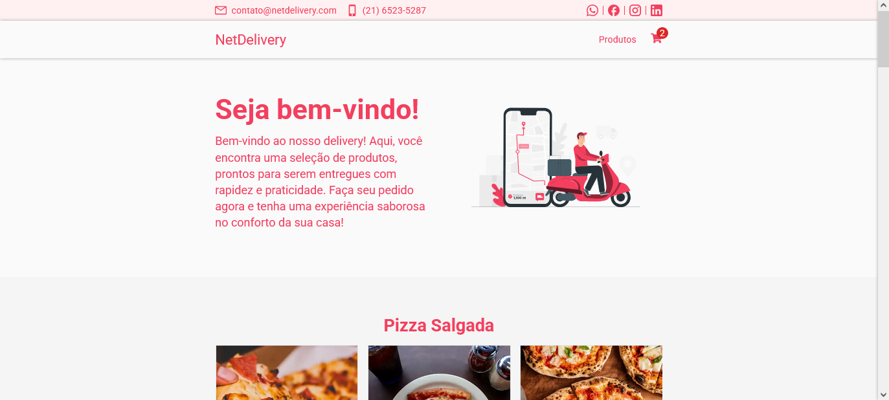

---

# NetDelivery

NetDelivery é uma plataforma de delivery de comida desenvolvida para lanchonetes e restaurantes gerenciarem pedidos, produtos e entregas de forma centralizada.

Os proprietários e suas equipes podem administrar produtos, acompanhar pedidos dos clientes, configurar taxas de entrega por CEP e gerenciar as áreas atendidas pelo estabelecimento através de um painel administrativo.

Os clientes podem navegar pelos produtos, adicionar itens ao carrinho, cadastrar endereços de entrega e realizar pedidos online de maneira simples e intuitiva.

O projeto foi desenvolvido com foco em arquitetura backend, autenticação, integração com PostgreSQL, Docker e fluxos completos de e-commerce.

---

## Tecnologias

- Python
- Django
- PostgreSQL
- NGINX
- Docker
- JavaScript
- Vue.js
- Webpack
- SASS
- Git

---

## Principais Funcionalidades

- Sistema de cadastro e login para clientes
- Consulta interna de CEP para disponibilidade de entrega
- Sistema de taxas para bairros atendidos pelo estabelecimento
- Carrinho de compras (preços, descontos, quantidades e total)
- Perfil do cliente com pedidos, dados pessoais e endereço
- Cadastro de bairros atendidos pelo estabelecimento
- Cadastro de produtos (título, imagem, descontos, etc.)
- Gerenciamento de pedidos (visualização, status e cancelamentos)
- Painel administrativo para donos e funcionários

---

## Demonstração

<a href="https://netdelivery.netlify.app/homepage/">Click aqui</a> para acessar o clone front-end do projeto para economizar custos com infraestrutura e hospedagem de servidores.

---

## Como Executar o Projeto

### 1. Clonar o Repositório

```bash
git clone https://github.com/GustavoDias7/netdelivery.git
cd netdelivery
```

---

### 2. Variáveis de Ambiente

```bash
cp .env.dev.example .env
```

Edite o arquivo `.env`:

```env
DJANGO_SUPERUSER_PASSWORD=change_me
SECRET_KEY=change_me
```

---

### 3. Configuração do PostgreSQL

Instale o PostgreSQL:

```bash
sudo apt update
sudo apt install postgresql postgresql-contrib
```

Abra o shell do PostgreSQL:

```bash
sudo -u postgres psql
```

Crie o banco de dados e o usuário:

```sql
CREATE DATABASE my_delivery_database;

CREATE USER my_delivery_user WITH PASSWORD 'my_delivery_password';

GRANT ALL PRIVILEGES ON DATABASE my_delivery_database TO my_delivery_user;
```

Inicie o PostgreSQL:

```bash
sudo service postgresql start
```

---

## Executando com Docker

```bash
docker compose up
```

---

## Executando sem Docker

#### Criar e ativar ambiente virtual

```bash
python -m venv myenv
source myenv/bin/activate
```

Instalar dependências:

```bash
pip install -r requirements.txt
```

Aplicar migrações:

```bash
python manage.py migrate
```

Carregar dados iniciais:

```bash
python manage.py loaddata address.json order.json product.json
```

Criar superusuário:

```bash
python manage.py createsuperuser --no-input
```

Executar servidor:

```bash
python manage.py runserver
```

URL da aplicação:

```txt
http://127.0.0.1:8000
```

---

## Assets do Front-end

Instalar dependências:

```bash
yarn install
```

Modo de desenvolvimento:

```bash
yarn dev
```

Build de produção:

```bash
yarn build
```

---

## Links de Acesso

Acesse o painel administrativo da aplicação:

```txt
http://127.0.0.1:8000/admin
```

Acesse a perfil da loja utilizando seu nome de usuário:

```txt
http://127.0.0.1:8000/my_username
```
